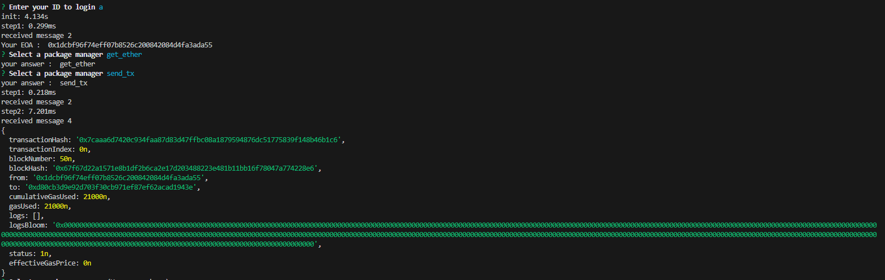
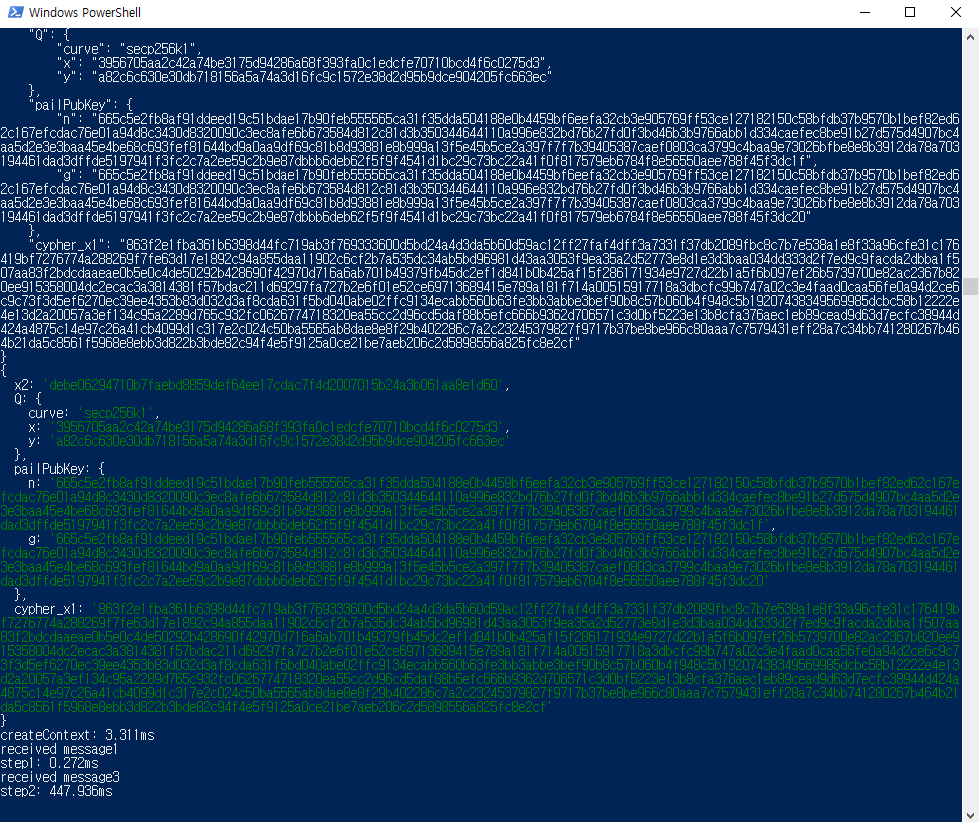
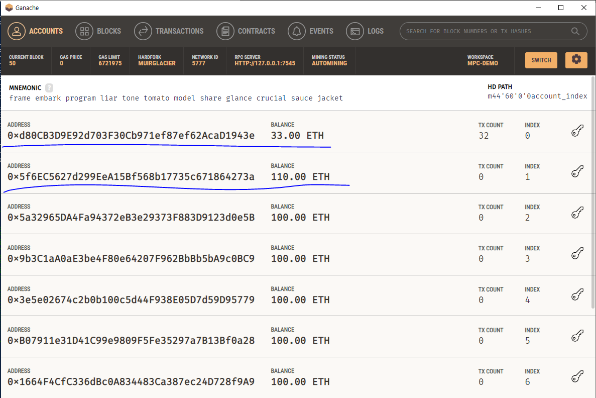

# 2 Party ECDSA MPC Demo

Warning: 이 프로젝트는 내부 PoC 용도로 만들어진 프로젝트이며, MPC의 핵심이 되는 라이브러리인 two-party-ecdsa-js을 사용합니다. 따라서 비상업적인 목적으로만 활용되어야합니다.

## 테스트 환경

1. Ethereum Network <br/>
   1-1. Ethereum Client : Ethereum Simulator(Ganache) <br/>
   1-2. Hardfork : Muir Glacier <br/>
2. Server/Client (모두 아래의 하나의 호스트에서 구성) <br/>
   2-1. OS : Windows 10 <br/>
   2-2. Node.JS : 20.14.0 <br/>

## 실행 절차

프로젝트 다운로드 및 설치

```shell
> git clone https://github.com/agileholystar/mpc-demo.git
> npm i
```

새로운 터미널을(터미널 2) 실행하고, 그 터미널에서 아래 명령을 수행하여 서버 실행

```shell
> node server/app.js
```

또 새로운 터미널을(터미널 3) 실행하고, 그 터미널에서 아래 명령을 수행하여 로컬 테스트 네트워크 구축

```shell
> ganache-cli  --> 호환성만 맞는다면 gui 기반 ganache, hardhat network 등 사용하기 편리한거 써도 상관없음
```

첫번째 터미널에서, 아래 명령을 수행하여 클라이언트를 실행한다.

```shell
> node client/main.js
? Enter your ID to login --> 아무 문자열을 입력한다.
? Select a package manager  --> 아래 4개의 메뉴에서 커서키를 동해 선택한다.
sign      --> 임의의 문자열을 입력하여 그것에 대해 서명 생성
verify    --> sign으로 생성된 서명을 검증
send_tx   --> MPC를 통해 생성된 EOA를 통해 1 ether를 로컬 테스트 네트워크의 관리자 계정으로 보낸다.
get_ther --> 로컬 테스트 네트워크의 관리자 계정으로부터 1 ether를 MPC를 통해 생성된 EOA로 받는다.
```

클라이언트 실행 화면


서버 실행 화면


블록체인 실행 화면

